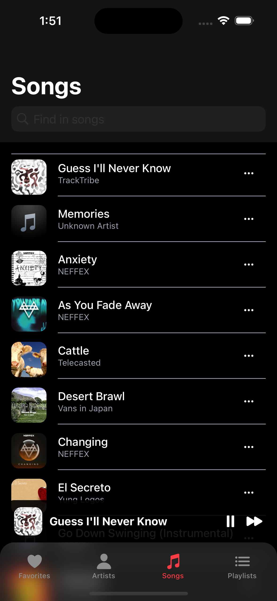
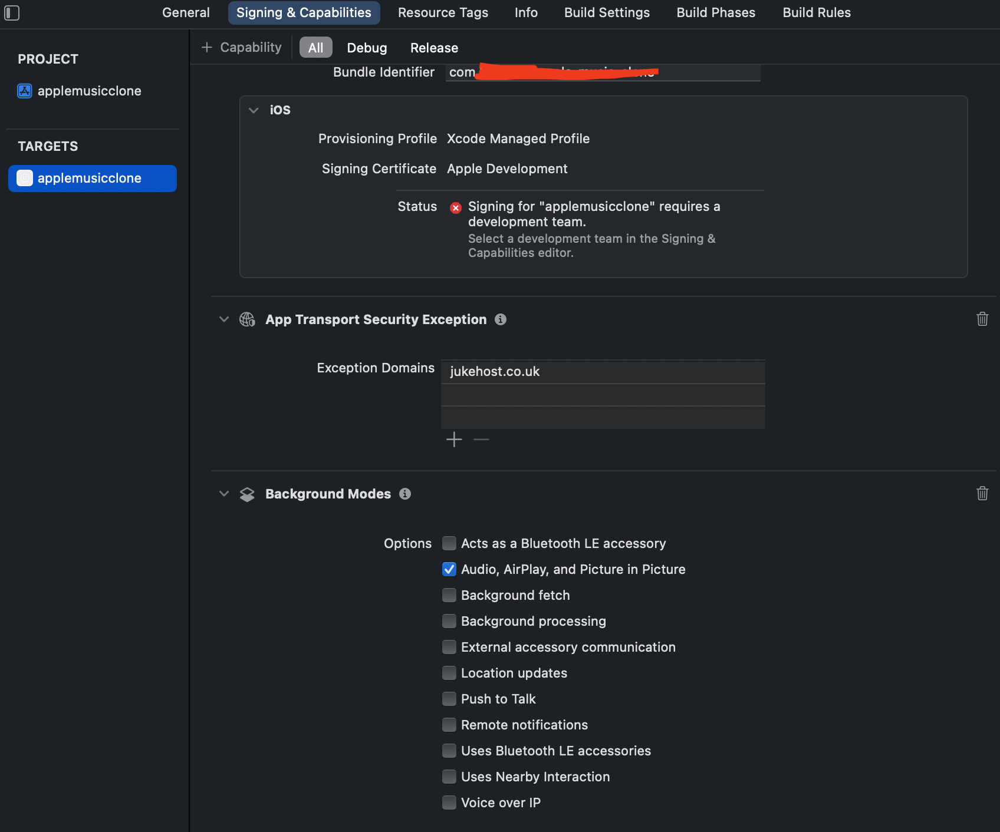
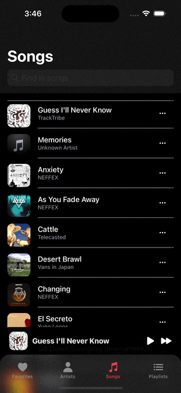

# 애플뮤직 클론코딩하기 (+) React-Native 정리

🔗 [youtube: Build a Music Player app with React Native, Expo, Typescript and Zustand](https://www.youtube.com/watch?v=9CElrkFwiBU)<br/>
🔗 [github: music-player](https://github.com/CodeWithGionatha-Labs/music-player)<br/>

## 🍏 Project Setup

> git clone <git 주소><br/>
> npx create-expo-app --template blank .<br/>
> npx expo install expo-linking react-native-screens react-native-safe-area-context expo-constants expo-status-bar<br/>
> npm install @react-navigation/native react-native-gesture-handler<br/>

### 1. /screens/ArtistsScreen.js, FavoritesScreen.js, PlaylistsScreen.js, SongsScreen.js, ... 생성

```js
import {View, Text} from 'react-native'

const ArtistsScreen = () => {
	return (
		<View>
			<Text>Artists</Text>
		</View>
	)
}

export default ArtistsScreen
```

모든 스크린 페이지들 우선 위와 같이 세팅

### 2. 네비게이션 세팅

가장 상단에 BottomTabNavigation을 두고 각각 하위에 native-stack navigation을 이용.

```
- MainBottomTabNavigator
	- SongsStackNavigation
	- ArtistsStackNavigation
	- PlayListsStackNavigation
	- FavoritesStackNavigation
```

#### `MainBottomTabNavigator.js`

```js
import {createBottomTabNavigator} from '@react-navigation/bottom-tabs'
import {BlurView} from 'expo-blur'
import Ionicons from '@expo/vector-icons/Ionicons'
import {StyleSheet} from 'react-native'

const Tab = createBottomTabNavigator()

import ArtistsStackNavigation from './ArtistsStackNavigation'
import FavoritesStackNavigation from './FavoritesStackNavigation'
import PlaylistsStackNavigation from './PlayListsStackNavigation'
import SongsStackNavigation from './SongsStackNavigation'

import {colors} from '../helper/constants'

const MainBottomTabNavigator = () => {
	return (
		<Tab.Navigator
			initialRouteName='Favorites'
			screenOptions={{
				headerShown: false,
				tabBarActiveTintColor: colors.primary,
				tabBarStyle: {
					position: 'absolute',
					borderTopLeftRadius: 20,
					borderTopRightRadius: 20,
					borderTopWidth: 0,
					paddingTop: 8,
				},
				tabBarBackground: () => (
					<BlurView
						intensity={40}
						style={{
							...StyleSheet.absoluteFillObject,
							overflow: 'hidden',
							borderTopLeftRadius: 20,
							borderTopRightRadius: 20,
						}}
					/>
				),
			}}
		>
			<Tab.Screen
				name='Favorites'
				component={FavoritesStackNavigation}
				options={{
					tabBarIcon: ({color, size}) => <Ionicons name='heart' color={color} size={size} />,
				}}
			/>
			<Tab.Screen
				name='Artists'
				component={ArtistsStackNavigation}
				options={{
					tabBarIcon: ({color, size}) => <Ionicons name='person' color={color} size={size} />,
				}}
			/>
			<Tab.Screen
				name='Songs'
				component={SongsStackNavigation}
				options={{
					tabBarIcon: ({color, size}) => <Ionicons name='musical-notes' color={color} size={size} />,
				}}
			/>
			<Tab.Screen
				name='Playlists'
				component={PlaylistsStackNavigation}
				options={{
					tabBarIcon: ({color, size}) => <Ionicons name='list' color={color} size={size} />,
				}}
			/>
		</Tab.Navigator>
	)
}

export default MainBottomTabNavigator
```

#### `SongsStackNavigation.js`

```js
import {createNativeStackNavigator} from '@react-navigation/native-stack'

const Stack = createNativeStackNavigator()

import {colors} from '../helper/constants'

import SongsScreen from '../screens/SongsScreen'
import SongDetailScreen from '../screens/SongDetailScreen'

const SongsStackNavigation = () => {
	return (
		<Stack.Navigator
			screenOptions={{
				headerLargeTitle: true,
				headerStyle: {
					backgroundColor: colors.background,
				},
				headerTintColor: colors.text,
				headerBlurEffect: 'systemUltraThinMaterial',
				contentStyle: {
					backgroundColor: colors.background,
					paddingHorizontal: 16,
				},
			}}
		>
			<Stack.Screen name='SongsScreen' options={{title: 'Songs'}} component={SongsScreen} />
			<Stack.Screen name='SongDetail' component={SongDetailScreen} />
		</Stack.Navigator>
	)
}

export default SongsStackNavigation
```

#### `ArtistsStackNavigation.js`

```js
import {createNativeStackNavigator} from '@react-navigation/native-stack'

const Stack = createNativeStackNavigator()

import {colors} from '../helper/constants'

import ArtistsScreen from '../screens/ArtistsScreen'
import ArtistDetailScreen from '../screens/ArtistDetailScreen'

const ArtistsStackNavigation = () => {
	return (
		<Stack.Navigator
			screenOptions={{
				headerLargeTitle: true,
				headerStyle: {
					backgroundColor: colors.background,
				},
				headerTintColor: colors.text,
				headerBlurEffect: 'systemUltraThinMaterial',
				contentStyle: {
					backgroundColor: colors.background,
					paddingHorizontal: 16,
				},
			}}
		>
			<Stack.Screen name='ArtistsScreen' options={{title: 'Artists'}} component={ArtistsScreen} />
			<Stack.Screen name='ArtistDetail' component={ArtistDetailScreen} />
		</Stack.Navigator>
	)
}

export default ArtistsStackNavigation
```

#### `PlayListsStackNavigation.js`

```js
import {createNativeStackNavigator} from '@react-navigation/native-stack'

const Stack = createNativeStackNavigator()

import {colors} from '../helper/constants'

import PlaylistsScreen from '../screens/PlaylistsScreen'
import PlaylistDetailScreen from '../screens/PlaylistDetailScreen'

const PlaylistsStackNavigation = () => {
	return (
		<Stack.Navigator
			screenOptions={{
				headerLargeTitle: true,
				headerStyle: {
					backgroundColor: colors.background,
				},
				headerTintColor: colors.text,
				headerBlurEffect: 'systemUltraThinMaterial',
				contentStyle: {
					backgroundColor: colors.background,
					paddingHorizontal: 16,
				},
			}}
		>
			<Stack.Screen name='PlaylistsScreen' options={{title: 'Playlists'}} component={PlaylistsScreen} />
			<Stack.Screen name='PlaylistDetail' component={PlaylistDetailScreen} />
		</Stack.Navigator>
	)
}

export default PlaylistsStackNavigation
```

#### `FavoritesStackNavigation.js`

```js
import {createNativeStackNavigator} from '@react-navigation/native-stack'

const Stack = createNativeStackNavigator()

import {colors} from '../helper/constants'

import FavoritesScreen from '../screens/FavoritesScreen'
import FavoriteDetailScreen from '../screens/FavoriteDetailScreen'

const FavoritesStackNavigation = () => {
	return (
		<Stack.Navigator
			screenOptions={{
				headerLargeTitle: true,
				headerStyle: {
					backgroundColor: colors.background,
				},
				headerTintColor: colors.text,
				headerBlurEffect: 'systemUltraThinMaterial',
				contentStyle: {
					backgroundColor: colors.background,
					paddingHorizontal: 16,
				},
			}}
		>
			<Stack.Screen name='FavoritesScreen' options={{title: 'Favorites'}} component={FavoritesScreen} />
			<Stack.Screen name='FavoriteDetail' component={FavoriteDetailScreen} />
		</Stack.Navigator>
	)
}

export default FavoritesStackNavigation
```

### 3. Deep link

#### `app.json`

```json
{
	"expo": {
		"scheme": "myapp"
	}
}
```

#### `/navigations/navigationConfig.js`

```js
import * as Linking from 'expo-linking'

const prefix = Linking.createURL('/')

const navigationConfig = {
	prefixes: [prefix],
	config: {
		// 최상위 네비게이터가 Tab Navigator.
		screens: {
			PlaylistsTab: {
				path: 'playlists', // URL 경로: yourapp://playlists
				screens: {
					// PlaylistsTab 내부의 Stack Navigator에 있는 화면들
					PlaylistsList: 'playlists', // yourapp://playlists/list
					PlaylistDetail: 'playlists/:id', // yourapp://playlists/detail/123 (id는 파라미터)
				},
			},
			ArtistsTab: {
				path: 'artists', // URL 경로: yourapp://artists
				screens: {
					ArtistsList: 'artists',
					ArtistDetail: 'artists/:id',
				},
			},
			SongsTab: {
				path: 'songs', // URL 경로: yourapp://songs
				screens: {
					SongsList: 'songs',
					SongDetail: 'songs/:id',
				},
			},
			FavoritesTab: {
				path: 'favorites', // URL 경로: yourapp://favorites
				screens: {
					FavoritesList: 'favorites',
					FavoriteDetail: 'favorites/:id',
				},
			},
		},
	},
}

export default navigationConfig
```

🔗 [React-Native Navigation. Deep-linking](https://reactnavigation.org/docs/deep-linking/?config=dynamic)<br/>
🔗 [React-Native Navigation. Configuring-links](https://reactnavigation.org/docs/configuring-links/)<br/>
🔗 [Expo에서 React Navigation과 DeepLink](https://velog.io/@hamster/Expo%EC%97%90%EC%84%9C-React-Navigation%EA%B3%BC-DeepLink)<br/>

### 4. App.js

```js
import {View} from 'react-native'
import {SafeAreaProvider} from 'react-native-safe-area-context'
import {StatusBar} from 'expo-status-bar'
import {NavigationContainer} from '@react-navigation/native'

// import StackNavigator from './navigations/StackNavigator'
import MainBottomTabNavigator from './navigations/MainBottomTabNavigator'
import navigationConfig from './navigations/navigationConfig'

export default function App() {
	return (
		<SafeAreaProvider>
			<StatusBar style='light' />
			<NavigationContainer linking={navigationConfig}>
				<MainBottomTabNavigator />
			</NavigationContainer>
		</SafeAreaProvider>
	)
}
```

> npx uri-scheme open "exp://<ip주소>:<port>/--/home/favorites" --ios

<br/>

## 🎵 Songs Screen

### 1. flashlist를 이용하여 더미 데이터 표현.

#### 1-1. dummy-data.json

```json
[
	{
		"url": "https://audio.jukehost.co.uk/vTRYaTEbpaYRCxiWGgL2S91mnOuMKfLw",
		"title": "Guess I'll Never Know",
		"artist": "TrackTribe",
		"artwork": "https://f4.bcbits.com/img/a3736661212_65",
		"rating": 1,
		"playlist": ["Chill 🌱"]
	},
	{
		"url": "https://audio.jukehost.co.uk/priWy2vYsWODmQiM6KevNYVLpPJGPZGd",
		"title": "Memories",
		"playlist": ["Instrumental 🎵"]
	},
	{
		"url": "https://audio.jukehost.co.uk/rSmGXxf0OJLipPwFRyvoFKodDOj5VuWf",
		"title": "Anxiety",
		"artist": "NEFFEX",
		"artwork": "https://i1.sndcdn.com/artworks-iCqupgQNLXSjKspS-0CGreg-t500x500.jpg",
		"playlist": ["Chill 🌱", "Instrumental 🎵", "Rap 🎤"]
	},
	{
		"url": "https://audio.jukehost.co.uk/ZLdoXNocDAcsgeq6QKtPRHyvlqslNbke",
		"title": "As You Fade Away",
		"artist": "NEFFEX",
		"artwork": "https://i.ytimg.com/vi/JhUFfaArYk8/maxresdefault.jpg",
		"rating": 1,
		"playlist": ["Rap 🎤"]
	},
	{
		"url": "https://audio.jukehost.co.uk/rZ9sshicVlki8Dnm95ps1eWhK95dYgKF",
		"title": "Cattle",
		"artist": "Telecasted",
		"artwork": "https://i.ytimg.com/vi/rxmWdkluHJ0/maxresdefault.jpg",
		"playlist": ["Chill 🌱"]
	},
	{
		"url": "https://audio.jukehost.co.uk/ZufGK11EtwQWXge8xYo5EQ02RuJqtr4s",
		"title": "Desert Brawl",
		"artist": "Vans in Japan",
		"artwork": "https://i.ytimg.com/vi/Kk0xLSNMPeQ/maxresdefault.jpg"
	},
	{
		"url": "https://audio.jukehost.co.uk/Tn0JjUOFnQXt94p3CQCA4AkB3weF51Yf",
		"title": "Changing",
		"artist": "NEFFEX",
		"artwork": "https://i1.sndcdn.com/artworks-ZaFhh1AQdO4hqdYb-ssYmcA-t500x500.jpg",
		"rating": 1,
		"playlist": ["Rap 🎤"]
	},
	{
		"url": "https://audio.jukehost.co.uk/yA5v0HqEX7pRLKDkjp3XeFDcksZVv7lr",
		"title": "El Secreto",
		"artist": "Yung Logos",
		"artwork": "https://i.ytimg.com/vi/VMfrx6lbsEQ/maxresdefault.jpg"
	},
	{
		"url": "https://audio.jukehost.co.uk/BTIDaoKPirPWaPpHl8SOsIU8Ge9Zx9Mb",
		"title": "Go Down Swinging (Instrumental)",
		"artist": "NEFFEX",
		"playlist": ["Instrumental 🎵", "Rap 🎤"]
	},
	{
		"url": "https://audio.jukehost.co.uk/nXa6f08Ojlz1V2SYJ3axYmSa7ot0hblZ",
		"title": "Hotlanta",
		"artist": "TrackTribe",
		"artwork": "https://i.ytimg.com/vi/fwuW0HpXA30/maxresdefault.jpg",
		"rating": 1
	},
	{
		"url": "https://audio.jukehost.co.uk/cbMVQp4JGHhSNEeCqRjvieiigYpUaE0s",
		"title": "Take Me Back",
		"artist": "NEFFEX",
		"artwork": "https://i1.sndcdn.com/artworks-yaXBlJOtjWvRcNnA-W6spcw-t500x500.jpg",
		"playlist": ["Rap 🎤"]
	},
	{
		"url": "https://audio.jukehost.co.uk/Ge9fdTsk6Y9SWoOnC7QJH0n8pprU7rev",
		"title": "mellow-future-bass-bounce-on-it",
		"playlist": ["Chill 🌱", "Instrumental 🎵"]
	},
	{
		"url": "https://audio.jukehost.co.uk/KDOr4agGwHHvikLtk9zukiiDpYNzIp8w",
		"title": "Outside the Box",
		"artist": "Patrick Patrikios",
		"rating": 1
	},
	{
		"url": "https://audio.jukehost.co.uk/K4PdyskIIfRrRotZtwF0EfHkJGjTs9Dy",
		"title": "Smokey's Lounge",
		"artist": "TrackTribe",
		"artwork": "https://i.scdn.co/image/ab67616d0000b2730efb49aab6109fe4c74d6b04"
	},
	{
		"url": "https://audio.jukehost.co.uk/5MLu9yZCOGOCpf9yhdK4uitEv2CZ9fwx",
		"title": "Sunny Days",
		"artist": "Anno Domini Beats",
		"artwork": "https://i1.sndcdn.com/artworks-fJ47RvWYE7weOhay-V5Qjyw-t500x500.jpg",
		"playlist": ["Chill 🌱"]
	},
	{
		"url": "https://audio.jukehost.co.uk/bnvYr6BoqfoZjrx72rvq3hGXyE6b7Qyz",
		"title": "Hidden Frozen Lake - Go By Ocean",
		"artist": "Ryan McCaffrey",
		"playlist": ["Chill 🌱"]
	}
]
```

<br/>

#### 1-2. SongsScreen.js

```js
import {Text} from 'react-native'
import {ScrollView} from 'react-native-gesture-handler'
import {useLayoutEffect, useRef} from 'react'
import {useDisplayHeader} from '../helper/useDisplayHeader'

import {defaultStyles} from '../helper/styles'
import TrackList from '../components/TrackList'

const SongsScreen = ({navigation}) => {
	const scrollViewRef = useRef(null)
	// console.log('SongsScreen - scrollViewRef', scrollViewRef)
	const {headerShown, headerTintColor, headerBackground} = useDisplayHeader(scrollViewRef)

	// useLayoutEffect(() => {
	// navigation.setOptions({headerShown, headerTintColor, headerBackground})
	// }, [headerShown, headerTintColor, headerBackground])

	return (
		<ScrollView ref={scrollViewRef} style={[defaultStyles.container, {flex: 1}]}>
			<TrackList />
		</ScrollView>
	)
}

export default SongsScreen
```

#### 1-3. TrackList.js

```js
import {View, Text, StyleSheet, Image, TouchableOpacity} from 'react-native'
import {FlashList} from '@shopify/flash-list'
import Ionicons from '@expo/vector-icons/Ionicons'

import {getMusicData} from '../helper/musicFunctions'

import {defaultArtwork, colors, fontSize} from '../helper/constants'

const TrackList = () => {
	const data = getMusicData()

	const renderItem = ({item}) => {
		return (
			<TouchableOpacity style={[styles.container, {borderTopWidth: item.id === 0 ? 1 : 0, borderTopColor: colors.textMuted, borderBottomWidth: item.id === data.length - 1 ? 1 : 0, borderBottomColor: colors.textMuted}]}>
				<Image source={item.artwork ? {uri: item.artwork} : defaultArtwork} style={styles.image} />
				<View style={{flex: 1, flexDirection: 'row', alignItems: 'center', justifyContent: 'space-between', paddingRight: 16, borderBottomWidth: item.id === data.length - 1 ? 0 : 1, borderBottomColor: colors.textMuted, paddingBottom: 15}}>
					<View style={[styles.textContainer, {}]}>
						<Text style={styles.title} numberOfLines={1}>
							{item.title}
						</Text>
						<Text style={styles.artist}>{item.artist ?? 'Unknown Artist'}</Text>
					</View>
					<Ionicons name='ellipsis-horizontal' size={16} color={colors.text} />
				</View>
			</TouchableOpacity>
		)
	}
	return <FlashList data={data} renderItem={renderItem} estimatedItemSize={data.length} keyExtractor={(item) => item.id} contentContainerStyle={{paddingTop: 16, paddingBottom: 100}} />
}

export default TrackList

const styles = StyleSheet.create({
	container: {
		flexDirection: 'row',
		alignItems: 'center',
		gap: 16,
		paddingVertical: 5,
	},
	image: {
		width: 50,
		height: 50,
		borderRadius: 10,
	},
	textContainer: {
		flex: 1,
	},
	title: {
		// width: 220,
		fontSize: fontSize.sm,
		fontWeight: '500',
		color: colors.text,
	},
	artist: {
		fontSize: fontSize.xs,
		color: colors.textMuted,
	},
})
```


<br/>

### 2. Songs 페이지 header에 서치바 추가.

#### SongsScreen.js

```js
import {ScrollView} from 'react-native'

import {defaultStyles} from '../helper/styles'
import useNavigationSearch from '../helper/useNavigationSearch'

import TrackList from '../components/TrackList'

const SongsScreen = () => {
	const {search} = useNavigationSearch()

	return (
		<ScrollView contentInsetAdjustmentBehavior='automatic' style={[defaultStyles.container, {flex: 1, position: 'relative'}]}>
			<TrackList />
		</ScrollView>
	)
}

export default SongsScreen
```

#### useNavigationSearch.js

```js
import {useState, useCallback, useLayoutEffect} from 'react'
import {useNavigation} from '@react-navigation/native'

import {colors} from './constants'

const useNavigationSearch = () => {
	const navigation = useNavigation()

	const [search, setSearch] = useState('')

	const handleSearch = (text) => {
		setSearch(text)
	}

	useLayoutEffect(() => {
		navigation.setOptions({
			headerSearchBarOptions: {
				placeholder: 'Find in songs',
				hintTextColor: colors.text,
				textColor: colors.text,
				headerIconColor: colors.text,
				hideWhenScrolling: true,
				hideNavigationBar: true,
				onChangeText: (event) => handleSearch(event.nativeEvent.text),
			},
		})
	}, [navigation])

	return {search}
}

export default useNavigationSearch
```

#### _Animated를 이용하는 방법(그러나 native-stack navigation을 이용하는게 쉬움)_

```js
import {useLayoutEffect, useRef} from 'react'
import {Animated, StyleSheet} from 'react-native'
import {BlurView} from 'expo-blur'

import {colors} from '../helper/constants'
import {defaultStyles} from '../helper/styles'
import TrackList from '../components/TrackList'

const SongsScreen = ({navigation}) => {
	const scrollY = useRef(new Animated.Value(0)).current

	const handlerScroll = (e) => {
		const position = e.nativeEvent.contentOffset.y
		// console.log('SongsScreen - position', position)
		scrollY.setValue(position)
	}

	const headerHeight = scrollY.interpolate({
		inputRange: [0, 100],
		outputRange: [200, 97.7],
		extrapolate: 'clamp',
	})

	useLayoutEffect(() => {
		navigation.setOptions({
			headerBackground: () => <Animated.View style={{...StyleSheet.absoluteFillObject, backgroundColor: colors.background, height: headerHeight}}></Animated.View>,
		})
	}, [headerHeight])

	return (
		<Animated.ScrollView scrollEventThrottle={10} onScroll={handlerScroll} style={[defaultStyles.container, {flex: 1, position: 'relative', paddingTop: 100}]}>
			<TrackList />
		</Animated.ScrollView>
	)
}

export default SongsScreen
```

🔗 [블로그](https://velog.io/@ttoottie/RN-%EC%8A%A4%ED%81%AC%EB%A1%A4%EC%97%90-%EB%94%B0%EB%9D%BC-%EC%BB%B4%ED%8F%AC%EB%84%8C%ED%8A%B8%EB%A5%BC-%EB%8F%99%EC%A0%81%EC%9C%BC%EB%A1%9C-%EB%B3%80%ED%99%94%EC%8B%9C%EC%BC%9C%EB%B3%B4%EC%9E%90)를 참고하여 스크롤 시, 헤더의 높이가 변하도록 수정하였다. 원래 react-native-reanimated를 사용할까 했지만 🔗[이 레딧](https://www.reddit.com/r/reactnative/comments/1hrv9c9/how_to_create_this_header_animation_with_react/)의 댓글을 보고 그냥 Animated API를 사용할 수 있을 거 같아 위와같이 추가하였다.

> `아무래도 reanimated나 Animated API나 추가적인 공부가 필요할 듯 싶다. 별도의 프로젝트를 추가하는걸로..ㅎㅎ`

아무튼 위와 같이 스타일을 추가했으므로 기존에 스크롤을 내리지 않은 경우, 서치 바가 보이도록 할 예정이다.


<br/>

### 3. 서치 로직 추가

#### useNavigatiionSearch.js

```js
import {useState, useLayoutEffect} from 'react'
import {useNavigation} from '@react-navigation/native'

import {colors} from './constants'

import musics from '../assets/dummy-data.json'

const useNavigationSearch = () => {
	const navigation = useNavigation()

	const [search, setSearch] = useState('')
	const [searchResults, setSearchResults] = useState(musics)

	const handleSearch = (text) => {
		setSearch(text)
		const searchText = (text || '').toLowerCase()
		const results = musics.filter((item) => {
			const title = item.title ? item.title.toLowerCase() : ''
			const artist = item.artist ? item.artist.toLowerCase() : ''
			return title.includes(searchText) || artist.includes(searchText)
		})
		setSearchResults(results)
	}

	useLayoutEffect(() => {
		navigation.setOptions({
			headerStyle: {
				backgroundColor: 'transparent',
			},
			headerBlurEffect: 'dark',
			headerSearchBarOptions: {
				placeholder: 'Find in songs',
				hintTextColor: colors.text,
				textColor: colors.text,
				headerIconColor: colors.text,
				hideWhenScrolling: true,
				hideNavigationBar: true,
				onChangeText: (event) => handleSearch(event.nativeEvent.text),
			},
		})
	}, [navigation])

	return {search, searchResults}
}

export default useNavigationSearch
```

#### SongsScreen.js

```js
import {ScrollView} from 'react-native'

import {defaultStyles} from '../helper/styles'
import useNavigationSearch from '../helper/useNavigationSearch'

import TrackList from '../components/TrackList'

const SongsScreen = () => {
	const {searchResults} = useNavigationSearch()

	return (
		<ScrollView contentInsetAdjustmentBehavior='automatic' style={[defaultStyles.container, {flex: 1, position: 'relative'}]}>
			<TrackList data={searchResults} />
		</ScrollView>
	)
}

export default SongsScreen
```

#### TrackList.js

```js
import {View, Text, StyleSheet, Image, TouchableOpacity} from 'react-native'
import {FlashList} from '@shopify/flash-list'
import Ionicons from '@expo/vector-icons/Ionicons'

// import {getMusicData} from '../helper/musicFunctions'

import {defaultArtwork, colors, fontSize} from '../helper/constants'

const TrackList = ({data}) => {
	// const data = getMusicData()

	const renderItem = ({item, index}) => {
		return (
			<TouchableOpacity
				style={[styles.container]}
				onPress={() => {
					console.log('TrackList-item')
				}}
			>
				<Image source={item.artwork ? {uri: item.artwork} : defaultArtwork} style={styles.image} />
				<View
					style={{
						flex: 1,
						flexDirection: 'row',
						alignItems: 'center',
						justifyContent: 'space-between',
						paddingRight: 16,
						borderBottomWidth: index === data.length - 1 ? 0 : 1,
						borderBottomColor: colors.textMuted,
						paddingTop: 5,
						paddingBottom: 15,
					}}
				>
					<View style={[styles.textContainer, {}]}>
						<Text style={styles.title} numberOfLines={1}>
							{item.title}
						</Text>
						<Text style={styles.artist}>{item.artist ?? 'Unknown Artist'}</Text>
					</View>
					<TouchableOpacity
						onPress={() => {
							console.log('TrackList-item.Icon')
						}}
					>
						<Ionicons name='ellipsis-horizontal' size={16} color={colors.text} />
					</TouchableOpacity>
				</View>
			</TouchableOpacity>
		)
	}
	return (
		<FlashList
			// data={searchData.length > 0 ? searchData : data}
			data={data}
			renderItem={(item, index) => renderItem(item, index)}
			estimatedItemSize={data.length}
			keyExtractor={(item) => item.url}
			contentContainerStyle={{paddingTop: 16, paddingBottom: 100}}
			ListHeaderComponent={() => <View style={{height: 1, width: '100%', backgroundColor: colors.textMuted}} />}
			ListFooterComponent={() => <View style={{height: 1, width: '100%', backgroundColor: colors.textMuted}} />}
		/>
	)
}

export default TrackList

const styles = StyleSheet.create({
	container: {
		flexDirection: 'row',
		alignItems: 'center',
		gap: 16,
		paddingVertical: 5,
	},
	image: {
		width: 50,
		height: 50,
		borderRadius: 10,
	},
	textContainer: {
		flex: 1,
	},
	title: {
		// width: 220,
		fontSize: fontSize.sm,
		fontWeight: '500',
		color: colors.text,
	},
	artist: {
		fontSize: fontSize.xs,
		color: colors.textMuted,
	},
})
```

<br/>

## 💿 Track Player 추가하기

### 1. Setup

🔗 [React Native Track Player Document.](https://rntp.dev/docs/intro)
🔗 [관련 블로그 포스팅](https://dev.to/amitkumar13/building-a-custom-music-player-in-react-native-with-react-native-track-player-8gb)

#### app.json

🔗 [Expo Document. infoPlist](https://docs.expo.dev/versions/latest/config/app/#infoplist)
🔗 [Apple Document. UIBackgroundModes](https://developer.apple.com/documentation/bundleresources/information-property-list/uibackgroundmodes)

```json
{
	"expo": {
		"ios": {
			"supportsTablet": true,
			"backgroundColor": "#000",
			"infoPlist": {
				"UIBackgroundModes": ["audio"]
			}
		}
	}
}
```

> 이때, Expo Go로 하니까 오류..! 아마도 build 후 Track Player를 사용할 수 있는걸로 보임 따라서 아래의 명령어 수행
> npx expo prebuild
> npx react-native run-ios

#### 로컬 빌드 vs. 클라우드 빌드

1. 로컬빌드
   > npx react-native (run-ios|run-android)

내 컴퓨터에서 직접 빌드하여 시뮬레이터나 연결된 기기에서 즉시 실행. 로컬 개발용 명령어.

사용자님의 Mac에서 직접 Xcode를 통해 앱을 빌드하고, 즉시 iOS 시뮬레이터에 설치하여 실행해주는 역할을 합니다.

**장점**

- **빠른 개발 속도**: 코드를 조금 수정하고 바로 결과를 확인하는 과정이 매우 빠릅니다.
- **오프라인 작업 가능**: 인터넷 연결 없이도 빌드와 실행이 가능합니다.
- **직접적인 디버깅**: Xcode와 같은 네이티브 도구를 직접 사용하여 디버깅하기 용이합니다.

<br/>

2. 클라우드 빌드

   > eas build

Expo의 클라우드 서버에서 앱을 빌드. 이렇게 빌드된 파일은 다른사람에게 공유하거나 스토어에 앱을 제출 시 사용.

프로젝트 전체를 압축해서 Expo의 클라우드 빌드 서버로 보냅니다. 그러면 Expo 서버가 알아서 깨끗한 환경에서 네이티브 앱을 빌드해줍니다.

**사용하는 경우**

- **eas build --profile development**: 개발용 빌드를 만들 때 사용합니다. 이렇게 만들어진 앱은 Expo Go와 비슷하지만, react-native-track-player 같은 네이티브 모듈이 포함된 '나만의 커스텀 Expo Go'라고 생각할 수 있습니다. 이 파일을 실제 기기에 설치해서 테스트할 수 있습니다.
- **eas build --profile production**: 앱 스토어에 올릴 최종 출시용 앱을 만들 때 사용합니다.

**장점**

- **네이티브 환경 설정 불필요**: 내 컴퓨터에 Xcode나 Android Studio 설정이 복잡하게 얽혀있어도, 클린한 환경에서 빌드해주므로 성공률이 높습니다. (예: M1/M2 Mac에서 구형 프로젝트 빌드 시)
- **팀원과 공유 용이**: 빌드된 앱 파일(.ipa, .apk)을 링크로 쉽게 공유하여 팀원들이나 테스터들이 설치해볼 수 있습니다.
- **빌드 자동화**: Github Actions 등과 연동하여 CI/CD 파이프라인을 구축하기 좋습니다.

<br/>

### 2. React Native Track Player 이용하기

🔗 [React Native Track Player docs](https://rntp.dev/docs/basics/getting-started)<br/>
🔗 [blog | react native player 세팅하기](https://kevins-world.tistory.com/entry/react-native-track-player-%EC%84%B8%ED%8C%85%ED%95%98%EA%B8%B0-1)<br/>
🔗 [blog | Implementing react-native-track-player with Expo, including lock screen (Part 1: iOS)](https://medium.com/@gionata.brunel/implementing-react-native-track-player-with-expo-including-lock-screen-part-1-ios-9552fea5178c)<br/>

#### 2-1. `/helper/trackPlayer/services.js`

```js
// https://dev.to/amitkumar13/building-a-custom-music-player-in-react-native-with-react-native-track-player-8gb
import TrackPlayer, {Event} from 'react-native-track-player'

module.exports = async () => {
	try {
		TrackPlayer.addEventListener(Event.RemotePlay, () => TrackPlayer.play())
		TrackPlayer.addEventListener(Event.RemotePause, () => TrackPlayer.pause())
		TrackPlayer.addEventListener(Event.RemoteStop, () => TrackPlayer.stop())
		TrackPlayer.addEventListener(Event.RemoteNext, () => TrackPlayer.skipToNext())
		TrackPlayer.addEventListener(Event.RemotePrevious, () => TrackPlayer.skipToPrevious())
		TrackPlayer.addEventListener('remote-seek', async ({position}) => {
			await TrackPlayer.seekTo(position)
		})
	} catch (e) {
		console.error(e)
	}
}
```

<br/>

#### 2-2. `index.js`

```js
import {registerRootComponent} from 'expo'
import TrackPlayer from 'react-native-track-player'

import App from './App'

// registerRootComponent calls AppRegistry.registerComponent('main', () => App);
// It also ensures that whether you load the app in Expo Go or in a native build,
// the environment is set up appropriately
registerRootComponent(App)
TrackPlayer.registerPlaybackService(() => require('./helper/trackPlayer/services'))
```

<br/>

#### 2-3. `/helper/trackPlayer/useLogTrackPlayer.js`

```js
import TrackPlayer, {Event, useTrackPlayerEvents} from 'react-native-track-player'

const events = [Event.PlaybackState, Event.PlaybackError, Event.RemotePlay, Event.RemotePause, Event.RemoteStop, Event.RemoteNext, Event.RemotePrevious, Event.PlaybackActiveTrackChanged]

export const useLogTrackPlayer = () => {
	useTrackPlayerEvents(events, async (event) => {
		if (event.type === Event.PlaybackError) {
			console.warn('An error occurred while playing the track - event:', event)
		}

		if (event.type === Event.PlaybackState) {
			console.log('Playback state changed - event:', event)
		}

		if (event.type === Event.PlaybackActiveTrackChanged) {
			console.log('Playback active track changed - event:', event)
		}
	})
}
```

<br/>

#### 2-4. `App.js`

```js
import {SafeAreaProvider} from 'react-native-safe-area-context'
import {StatusBar} from 'expo-status-bar'
import {NavigationContainer} from '@react-navigation/native'

// import StackNavigator from './navigations/StackNavigator'
import MainBottomTabNavigator from './navigations/MainBottomTabNavigator'
import navigationConfig from './navigations/navigationConfig'
import MusicPlayer from './components/MusicPlayer'

export default function App() {
	return (
		<SafeAreaProvider>
			<StatusBar style='light' />
			<NavigationContainer linking={navigationConfig}>
				<MainBottomTabNavigator />
				<MusicPlayer />
			</NavigationContainer>
		</SafeAreaProvider>
	)
}
```

<br/>

#### 2-5. `/helper/trackPlayer/useSetupTrackPlayer.js`

```js
// https://velog.io/@blacksooooo/React-native-react-native-track-player%EB%A5%BC-%EC%9D%B4%EC%9A%A9%ED%95%B4-%EC%9D%8C%EC%9B%90-%ED%94%8C%EB%A0%88%EC%9D%B4%EC%96%B4-%EB%A7%8C%EB%93%A4%EA%B8%B0
// https://kevins-world.tistory.com/entry/react-native-track-player-%EC%84%B8%ED%8C%85%ED%95%98%EA%B8%B0-1

// 아래 대로 한번 해보기..
// https://medium.com/@gionata.brunel/implementing-react-native-track-player-with-expo-including-lock-screen-part-1-ios-9552fea5178c

import {useEffect, useRef} from 'react'
import TrackPlayer, {Capability, RepeatMode} from 'react-native-track-player'

import tracks from '../../assets/dummy-data.json'

const setupPlayer = async () => {
	try {
		await TrackPlayer.setupPlayer({
			maxCacheSize: 1024 * 10,
		})
		await TrackPlayer.setVolume(0.03)
		await TrackPlayer.updateOptions({
			capabilities: [Capability.Play, Capability.Pause, Capability.SkipToNext, Capability.SkipToPrevious, Capability.SeekTo, Capability.Stop],
			compactCapabilities: [Capability.Play, Capability.Pause],
		})
	} catch (e) {
		console.log('Error setting up player', e)
	}
}

export const addTracks = async () => {
	await TrackPlayer.add(tracks)
	await TrackPlayer.setRepeatMode(RepeatMode.Queue)
}

// export const getPlayerInfo = async () => {
// 	const state = (await TrackPlayer.getPlaybackState()).state
// 	if (state === State.Playing) {
// 		console.log('The Player is playing')
// 	}

// 	let trackIndex = await TrackPlayer.getActiveTrackIndex()
// 	let trackObject = await TrackPlayer.getTrack(trackIndex)
// 	console.log('The active track is:', trackObject)

// 	const position = await TrackPlayer.getProgress().then((progress) => progress.position)
// 	const duration = await TrackPlayer.getDuration().then((duration) => duration)
// 	console.log(`${duration - position} seconds left.`)
// }

export const useSetupTrackPlayer = ({onLoad, onTrackInfo}) => {
	const isInitialized = useRef(false)

	useEffect(() => {
		handleSetup()
	}, [onLoad])

	const handleSetup = async () => {
		try {
			await setupPlayer()
			isInitialized.current = true
			onLoad?.()
			await addTracks()
			onTrackInfo?.()
		} catch (e) {
			isInitialized.current = false
			console.error(e)
		}
	}
}
```

<br/>

#### 2-6. `/components/MusicPlayer.js`

```js
import {useState, useEffect, useCallback} from 'react'
import {View, Text, StyleSheet, TouchableOpacity, Dimensions, Image} from 'react-native'
import TrackPlayer, {State, Event, usePlaybackState, useProgress, useTrackPlayerEvents} from 'react-native-track-player'
import * as SplashScreen from 'expo-splash-screen'
import Ionicons from '@expo/vector-icons/Ionicons'

import {useSetupTrackPlayer} from '../helper/trackPlayer/useSetupTrackPlayer'
import {useLogTrackPlayer} from '../helper/trackPlayer/useLogTrackPlayer'

import {defaultArtwork} from '../helper/constants'
import tracks from '../assets/dummy-data.json'

SplashScreen.preventAutoHideAsync()

SplashScreen.setOptions({
	duration: 1000,
	fade: true,
})

const MusicPlayer = () => {
	const [trackIndex, setTrackIndex] = useState(0)
	const [activeTrack, setActiveTrack] = useState(null)

	const playerState = usePlaybackState()
	const {position, duration} = useProgress()

	// Track Player Log 설정
	useLogTrackPlayer()

	// Track Player 세팅 1 - SplashScreen 숨기기
	const handleTrackPlayerLoad = useCallback(() => {
		SplashScreen.hideAsync()
	}, [])

	// Track Player 세팅 2 - 현재 재생 중인 트랙 정보 가져오기
	const handleTrackInfo = useCallback(async () => {
		let trackIndex = await TrackPlayer.getActiveTrackIndex()
		if (trackIndex !== null && trackIndex >= 0) {
			let trackObject = await TrackPlayer.getTrack(trackIndex)
			setActiveTrack(trackObject)
			setTrackIndex(trackIndex)
		}
	}, [])

	// Track Player 세팅 3 - 트랙 기본 세팅
	useSetupTrackPlayer({
		onLoad: handleTrackPlayerLoad,
		onTrackInfo: handleTrackInfo,
	})

	useTrackPlayerEvents([Event.PlaybackActiveTrackChanged], async (event) => {
		console.log('MusicPlayer-useTrackPlayerEvents-event', event)
		if (event.type === Event.PlaybackActiveTrackChanged && event.track != null) {
			const track = await TrackPlayer.getTrack(event.track)
			setActiveTrack(track)
			setTrackIndex(trackIndex)
		}
	})

	const togglePlayback = async (playerState) => {
		const currentTrack = await TrackPlayer.getActiveTrack()
		if (currentTrack !== null) {
			if (playerState.state === State.Paused || playerState.state === State.Ready) {
				console.log('MusicPlayer-togglePlayback-play')
				await TrackPlayer.play()
			} else {
				console.log('MusicPlayer-togglePlayback-pause')
				await TrackPlayer.pause()
			}
		}
	}

	const handleNextTrack = async () => {
		console.log('MusicPlayer-handleNextTrack-trackIndex', trackIndex, 'tracks.length', tracks.length)
		if (trackIndex < tracks.length - 1) {
			await TrackPlayer.skipToNext()
			const nextTrack = await TrackPlayer.getTrack(trackIndex + 1)
			console.log('MusicPlayer-handleNextTrack-nextTrack', nextTrack)
			setTrackIndex(trackIndex + 1)
			setActiveTrack(nextTrack)
		}
	}

	// 미니 플레이어 UI
	return (
		<TouchableOpacity style={styles.miniPlayerContainer}>
			<View style={styles.header}>
				<Image source={activeTrack?.artwork ? {uri: activeTrack?.artwork} : defaultArtwork} style={styles.image} />
				<Text style={styles.title}>{activeTrack?.title || '음악을 선택하세요'}</Text>
			</View>
			<View style={styles.controls}>
				{playerState.state === State.Playing ? (
					<TouchableOpacity onPress={() => togglePlayback(playerState)}>
						<Ionicons name='pause' size={24} color='white' />
					</TouchableOpacity>
				) : (
					<TouchableOpacity onPress={() => togglePlayback(playerState)}>
						<Ionicons name='play' size={24} color='white' />
					</TouchableOpacity>
				)}
				<TouchableOpacity onPress={handleNextTrack}>
					<Ionicons name='play-forward' size={24} color='white' />
				</TouchableOpacity>
			</View>
		</TouchableOpacity>
	)
}

export default MusicPlayer

const {width} = Dimensions.get('window')

const styles = StyleSheet.create({
	miniPlayerContainer: {
		position: 'absolute',
		bottom: 83,
		left: 10,
		right: 10,
		height: 60,
		backgroundColor: 'rgba(0,0,0,0.9)',
		borderRadius: 10,
		padding: 10,
		flexDirection: 'row',
		justifyContent: 'space-between',
	},
	header: {
		flexDirection: 'row',
		alignItems: 'center',
		gap: 10,
	},
	image: {
		width: 40,
		height: 40,
		borderRadius: 10,
	},
	title: {
		fontSize: 16,
		fontWeight: 'bold',
		color: 'white',
	},
	controls: {
		flexDirection: 'row',
		alignItems: 'center',
		gap: 10,
	},
})
```

<br/>

### 3. 에러 발생 및 해결

> 에러: 음원 재생이 시작된 직후 playing 상태로 전환되었다가 바로 오류가 발생

```bash
LOG  Playback state changed - event: {"state": "playing", "type": "playback-state"}
...
WARN  An error occurred while playing the track - event: {"error": "The operation couldn’t be completed. (SwiftAudioEx.AudioPlayerError.PlaybackError error 3.)", "type": "playback-error"}
LOG  Playback state changed - event: {"error": {"code": "ios_playback_failed", "message": "Playback of the track failed"}, "state": "error", "type": "playback-state"}
```

SwiftAudioEx.AudioPlayerError.PlaybackError 오류는 주로 iOS에서 오디오 파일을 불러오거나 재생하는 과정에서 문제가 발생했을 때 나타납니다. 특히 [AudioToolbox] timed out 로그는 음원 파일을 로드하는 데 시간이 초과되었음을 의미하며, 이는 다음과 같은 원인일 수 있습니다.

1. 음원 URL 문제: 현재 해당 주소가 유효하지 않거나, 서버에서 응답이 없는 경우 발생
2. 오디오 포맷 문제: iOS에서 지원하지 않는 오디오 형식이거나 파일 손상
3. 네트워크 보안 정책(ATS): iOS에서는 기본적으로 HTTPS 프로토콜을 사용해야 합니다. HTTP 프로토콜을 사용하는 URL의 음원을 재생하려고 할 때 App Transport Security (ATS) 설정이 되어있지 않으면 재생이 차단될 수 있습니다.

#### 1번 상황에 대한 확인. 문제 없음.

```bash
curl -I "https://audio.jukehost.co.uk/vTRYaTEbpaYRCxiWGgL2S91mnOuMKfLw"

server: cloudflare
access-control-allow-methods: GET, POST, OPTIONS
pragma: no-cache
cache-control: public, max-age=2073600
expires: Fri, 29 Aug 2025 01:24:23 GMT
last-modified: Sun, 17 Mar 2024 20:36:51 GMT
accept-ranges: 0-8182632
access-control-allow-origin: *
age: 5516
cf-cache-status: HIT
vary: accept-encoding
report-to: {"group":"cf-nel","max_age":604800,"endpoints":[{"url":"https://a.nel.cloudflare.com/report/v4?s=n4pWUep0Ts9W8Oq8ZPnqegN8CKoG76Nt%2FD2frvs%2FnVD9pEiWqlpGTFPpDrUkj7IzWO9J%2F18LSnN%2FlHJNJYhlE5dfejkJTA8%2FWo0baVVWi%2FCC3i1j"}]}
nel: {"report_to":"cf-nel","success_fraction":0.0,"max_age":604800}
cf-ray: 96a3054f29e7e39c-NRT
alt-svc: h3=":443"; ma=86400
```

#### 3번 상황에 대한 확인.

jukehost.co.uk의 URL은 https를 사용하고 있음에도 불구하고 문제가 발생. 이는 jukehost.co.uk 도메인이 ATS의 요구사항(예: 특정 TLS 버전, 암호화 스위트 등)을 충족하지 못할 수 있음을 시사함.

이를 해결하기 위해 Info.plist 파일에 예외 도메인을 추가하여 해당 도메인에 대한 ATS 제한을 완화해야 함. ios/applemusicclone/Info.plist 파일을 열어 NSAppTransportSecurity 설정을 추가.

```xml
<!-- Info.plist -->
<key>NSAppTransportSecurity</key>
<dict>
  <key>NSAllowsArbitraryLoads</key>
  <false/>
  <key>NSAllowsLocalNetworking</key>
  <true/>
  <key>NSExceptionDomains</key>
  <dict>
    <key>jukehost.co.uk</key>
    <dict>
      <key>NSIncludesSubdomains</key>
      <true/>
      <key>NSExceptionAllowsInsecureHTTPLoads</key>
      <true/>
    </dict>
  </dict>
</dict>
```

NSAppTransportSecurity 설정에 jukehost.co.uk 도메인을 예외 처리하는 코드를 추가. NSExceptionDomains 키를 사용하여 특정 도메인에 대한 ATS 규칙을 설정.

다시 빌드 후 확인하면 아래와 같이 정상적으로 재생이 되고 노래가 끝나면 다음 노래로 자연스럽게 넘어감.



<br/>

### 4. 백그라운드에서도 작동하도록 설정하기

🔗 [React Native Track Player | Background Mode](https://rntp.dev/docs/basics/background-mode)

> open apple-music_clone/ios/applemusicclone.xcworkspace



<br>

### 5. context를 도입하여 TrackList에서 재생할 노래 선택하기

#### 5-1. `/context/musicAppState.js`

```js
import {createContext, useReducer, useContext} from 'react'

const MusicState = createContext()
const MusicDispatch = createContext()

const initialState = {
	activeTrack: null,
	activeTrackIndex: 0,
}

const reducer = (state, action) => {
	switch (action.type) {
		case 'SET_ACTIVE_TRACK':
			return {...state, activeTrack: action.payload}
		case 'SET_ACTIVE_TRACK_INDEX':
			return {...state, activeTrackIndex: action.payload}
		default:
			return state
	}
}

const MusicStoreProvider = ({children}) => {
	const [state, dispatch] = useReducer(reducer, initialState)

	return (
		<MusicState.Provider value={state}>
			<MusicDispatch.Provider value={dispatch}>{children}</MusicDispatch.Provider>
		</MusicState.Provider>
	)
}

export const useMusicState = () => {
	const context = useContext(MusicState)
	if (!context) {
		throw new Error('useMusicState must be used within a MusicStoreProvider')
	}
	return context
}

export const useMusicDispatch = () => {
	const context = useContext(MusicDispatch)
	if (!context) {
		throw new Error('useMusicDispatch must be used within a MusicStoreProvider')
	}
	return context
}

export default MusicStoreProvider
```

MusicPlayer 뿐만 아니라 TrackList에서 아이템을 클릭했을 때에도 재생되는 노래 상태를 업데이트 할 수 있도록 Context API를 이용하여 상태 관리.

<br/>

#### 5-2. `/components/MusicPlayer.js`

```js
import {useState, useCallback} from 'react'
import {View, Text, StyleSheet, TouchableOpacity, Image} from 'react-native'
import TrackPlayer, {State, Event, usePlaybackState, useProgress, useTrackPlayerEvents} from 'react-native-track-player'
import * as SplashScreen from 'expo-splash-screen'
import Ionicons from '@expo/vector-icons/Ionicons'

import {useSetupTrackPlayer} from '../helper/trackPlayer/useSetupTrackPlayer'
import {useLogTrackPlayer} from '../helper/trackPlayer/useLogTrackPlayer'
import {defaultArtwork} from '../helper/constants'
import {useMusicState, useMusicDispatch} from '../context/musicAppState'

import tracks from '../assets/dummy-data.json'

SplashScreen.preventAutoHideAsync()

SplashScreen.setOptions({
	duration: 1000,
	fade: true,
})

const MusicPlayer = ({isMiniPlayer = true}) => {
	const state = useMusicState()
	const dispatch = useMusicDispatch()

	const playerState = usePlaybackState()
	const {position, duration} = useProgress()

	console.log(`남은 재생시간: ${duration - position}. trackIndex: ${state.activeTrackIndex}, activeTrack: ${state.activeTrack?.title}`)
	// useEffect(() => {
	// 	if (duration - position === 0) {
	// 		handleNextTrack()
	// 	}
	// }, [position, duration])

	// Track Player Log 설정
	useLogTrackPlayer()

	// Track Player 세팅 1 - SplashScreen 숨기기
	const handleTrackPlayerLoad = useCallback(() => {
		SplashScreen.hideAsync()
	}, [])

	// Track Player 세팅 2 - 현재 재생 중인 트랙 정보 가져오기
	const handleTrackInfo = useCallback(async () => {
		let trackIndex = await TrackPlayer.getActiveTrackIndex()
		if (trackIndex !== null && trackIndex >= 0) {
			let trackObject = await TrackPlayer.getTrack(trackIndex)
			dispatch({type: 'SET_ACTIVE_TRACK', payload: trackObject})
			dispatch({type: 'SET_ACTIVE_TRACK_INDEX', payload: trackIndex})
		}
	}, [])

	// Track Player 세팅 3 - 트랙 기본 세팅
	useSetupTrackPlayer({
		onLoad: handleTrackPlayerLoad,
		onTrackInfo: handleTrackInfo,
	})

	useTrackPlayerEvents([Event.PlaybackActiveTrackChanged], async (event) => {
		console.log('MusicPlayer-useTrackPlayerEvents-event', event)
		// event의 구조를 살펴보니, event.nextTrack은 없고 lastTrack과 track이 있음
		if (event.type === Event.PlaybackActiveTrackChanged && event.track != null) {
			const track = await TrackPlayer.getTrack(event.track)
			dispatch({type: 'SET_ACTIVE_TRACK', payload: track})
			dispatch({type: 'SET_ACTIVE_TRACK_INDEX', payload: event.track})
		}
	})

	const togglePlayback = async (playerState) => {
		const currentTrack = await TrackPlayer.getActiveTrack()
		if (currentTrack !== null) {
			if (playerState.state === State.Paused || playerState.state === State.Ready) {
				console.log('MusicPlayer-togglePlayback-play')
				await TrackPlayer.play()
			} else {
				console.log('MusicPlayer-togglePlayback-pause')
				await TrackPlayer.pause()
			}
		}
	}

	const handleNextTrack = async () => {
		console.log('MusicPlayer-handleNextTrack-trackIndex', state.activeTrackIndex, 'tracks.length', tracks.length)
		if (state.activeTrackIndex < tracks.length - 1) {
			const nextTrackIndex = state.activeTrackIndex + 1
			const nextTrack = await TrackPlayer.getTrack(nextTrackIndex)
			dispatch({type: 'SET_ACTIVE_TRACK', payload: nextTrack})
			dispatch({type: 'SET_ACTIVE_TRACK_INDEX', payload: nextTrackIndex})
			// await TrackPlayer.skipToNext()
		}
	}

	if (!isMiniPlayer) {
		return (
			<View style={{flex: 1, justifyContent: 'center', alignItems: 'center'}}>
				<Text>MusicPlayer</Text>
			</View>
		)
	}

	// 미니 플레이어 UI
	return (
		<TouchableOpacity style={styles.miniPlayerContainer}>
			<View style={styles.header}>
				<Image source={state.activeTrack?.artwork ? {uri: state.activeTrack?.artwork} : defaultArtwork} style={styles.image} />
				<Text style={styles.title}>{state.activeTrack?.title || '음악을 선택하세요'}</Text>
			</View>
			<View style={styles.controls}>
				{playerState.state === State.Playing ? (
					<TouchableOpacity onPress={() => togglePlayback(playerState)}>
						<Ionicons name='pause' size={24} color='white' />
					</TouchableOpacity>
				) : (
					<TouchableOpacity onPress={() => togglePlayback(playerState)}>
						<Ionicons name='play' size={24} color='white' />
					</TouchableOpacity>
				)}
				<TouchableOpacity onPress={handleNextTrack}>
					<Ionicons name='play-forward' size={24} color='white' />
				</TouchableOpacity>
			</View>
		</TouchableOpacity>
	)
}

export default MusicPlayer

const styles = StyleSheet.create({
	miniPlayerContainer: {
		position: 'absolute',
		bottom: 83,
		left: 10,
		right: 10,
		height: 60,
		backgroundColor: 'rgba(0,0,0,0.95)',
		borderRadius: 10,
		padding: 10,
		flexDirection: 'row',
		justifyContent: 'space-between',
	},
	header: {
		flexDirection: 'row',
		alignItems: 'center',
		gap: 10,
	},
	image: {
		width: 40,
		height: 40,
		borderRadius: 10,
	},
	title: {
		fontSize: 16,
		fontWeight: 'bold',
		color: 'white',
	},
	controls: {
		flexDirection: 'row',
		alignItems: 'center',
		gap: 10,
	},
})
```

기존에 `useState`를 통해 상태관리를 하던 대신, Context API로 교체.

<br/>

#### 5-3. `/components/TrackList.js`

```js
import {View, Text, StyleSheet, Image, TouchableOpacity} from 'react-native'
import {FlashList} from '@shopify/flash-list'
import Ionicons from '@expo/vector-icons/Ionicons'
import TrackPlayer from 'react-native-track-player'

import {useMusicState, useMusicDispatch} from '../context/musicAppState'
// import {getMusicData} from '../helper/musicFunctions'

import {defaultArtwork, colors, fontSize} from '../helper/constants'

const TrackList = ({data}) => {
	// const data = getMusicData()
	const state = useMusicState()
	const dispatch = useMusicDispatch()

	const renderItem = ({item, index}) => {
		return (
			<TouchableOpacity
				style={[styles.container]}
				onPress={() => {
					dispatch({type: 'SET_ACTIVE_TRACK', payload: item})
					dispatch({type: 'SET_ACTIVE_TRACK_INDEX', payload: index})
					TrackPlayer.play()
				}}
			>
				<Image source={item.artwork ? {uri: item.artwork} : defaultArtwork} style={styles.image} />
				<View
					style={{
						flex: 1,
						flexDirection: 'row',
						alignItems: 'center',
						justifyContent: 'space-between',
						paddingRight: 16,
						borderBottomWidth: index === data.length - 1 ? 0 : 1,
						borderBottomColor: colors.textMuted,
						paddingTop: 5,
						paddingBottom: 15,
					}}
				>
					<View style={[styles.textContainer, {}]}>
						<Text style={styles.title} numberOfLines={1}>
							{item.title}
						</Text>
						<Text style={styles.artist}>{item.artist ?? 'Unknown Artist'}</Text>
					</View>
					<TouchableOpacity
						onPress={() => {
							console.log('TrackList-item.Icon')
						}}
					>
						<Ionicons name='ellipsis-horizontal' size={16} color={colors.text} />
					</TouchableOpacity>
				</View>
			</TouchableOpacity>
		)
	}
	return (
		<FlashList
			// data={searchData.length > 0 ? searchData : data}
			data={data}
			renderItem={(item, index) => renderItem(item, index)}
			estimatedItemSize={data.length}
			keyExtractor={(item) => item.url}
			contentContainerStyle={{paddingTop: 16, paddingBottom: 100}}
			ListHeaderComponent={() => <View style={{height: 1, width: '100%', backgroundColor: colors.textMuted}} />}
			ListFooterComponent={() => <View style={{height: 1, width: '100%', backgroundColor: colors.textMuted}} />}
		/>
	)
}

export default TrackList

const styles = StyleSheet.create({
	container: {
		flexDirection: 'row',
		alignItems: 'center',
		gap: 16,
		paddingVertical: 5,
	},
	image: {
		width: 50,
		height: 50,
		borderRadius: 10,
	},
	textContainer: {
		flex: 1,
	},
	title: {
		// width: 220,
		fontSize: fontSize.sm,
		fontWeight: '500',
		color: colors.text,
	},
	artist: {
		fontSize: fontSize.xs,
		color: colors.textMuted,
	},
})
```

아이템 클릭시

```js
	onPress={() => {
					dispatch({type: 'SET_ACTIVE_TRACK', payload: item})
					dispatch({type: 'SET_ACTIVE_TRACK_INDEX', payload: index})
					TrackPlayer.play()
				}}
```

를 수행하게 하여 노래 업데이트 및 재생을 하도록 설정.


