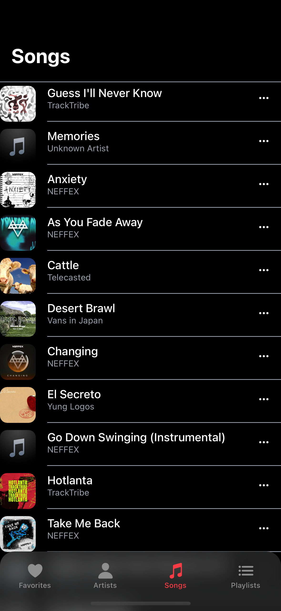
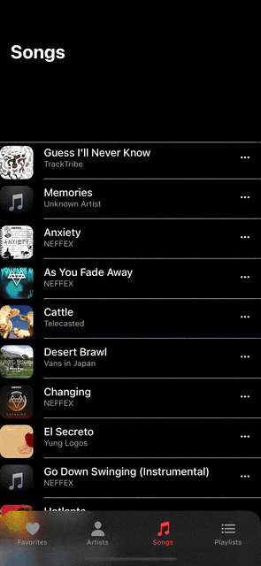

# 애플뮤직 클론코딩하기 (+) React-Native 정리

🔗 [youtube: Build a Music Player app with React Native, Expo, Typescript and Zustand](https://www.youtube.com/watch?v=9CElrkFwiBU)<br/>
🔗 [github: music-player](https://github.com/CodeWithGionatha-Labs/music-player)<br/>

## 🍏 Project Setup

> git clone <git 주소><br/>
> npx create-expo-app --template blank .<br/>
> npx expo install expo-linking react-native-screens react-native-safe-area-context expo-constants expo-status-bar<br/>
> npm install @react-navigation/native react-native-gesture-handler<br/>

### 1. /screens/ArtistsScreen.js, FavoritesScreen.js, PlaylistsScreen.js, SongsScreen.js, ... 생성

```js
import {View, Text} from 'react-native'

const ArtistsScreen = () => {
	return (
		<View>
			<Text>Artists</Text>
		</View>
	)
}

export default ArtistsScreen
```

모든 스크린 페이지들 우선 위와 같이 세팅

### 2. /navigators/MainBottomTabNavigator.js, StackNavigator.js 생성

#### `MainBottomTabNavigator.js`

```js
import {createBottomTabNavigator} from '@react-navigation/bottom-tabs'
import {BlurView} from 'expo-blur'
import Ionicons from '@expo/vector-icons/Ionicons'

const Tab = createBottomTabNavigator()

import ArtistsScreen from '../screens/ArtistsScreen'
import FavoritesScreen from '../screens/FavoritesScreen'
import PlaylistsScreen from '../screens/PlaylistsScreen'
import SongsScreen from '../screens/SongsScreen'

import {colors} from '../helper/constants'

const MainBottomTabNavigator = () => {
	return (
		<Tab.Navigator
			initialRoute='Favorites'
			screenOptions={{
				headerTintColor: colors.text,
				headerTitleAlign: 'left',
				headerTitleStyle: {
					fontSize: 20,
					fontWeight: 'bold',
				},
				headerStyle: {backgroundColor: colors.background},
				tabBarStyle: {position: 'absolute', paddingTop: 5},
				tabBarBackground: () => <BlurView intensity={100} tint='light' style={{flex: 1, backgroundColor: colors.background, opacity: 0.9}} />,
			}}
		>
			<Tab.Screen
				name='Favorites'
				component={FavoritesScreen}
				options={{
					tabBarIcon: ({color, size}) => <Ionicons name='heart' color={color} size={size} />,
				}}
			/>
			<Tab.Screen
				name='Artists'
				component={ArtistsScreen}
				options={{
					tabBarIcon: ({color, size}) => <Ionicons name='person' color={color} size={size} />,
				}}
			/>
			<Tab.Screen
				name='Songs'
				component={SongsScreen}
				options={{
					tabBarIcon: ({color, size}) => <Ionicons name='musical-notes' color={color} size={size} />,
				}}
			/>
			<Tab.Screen
				name='Playlists'
				component={PlaylistsScreen}
				options={{
					tabBarIcon: ({color, size}) => <Ionicons name='list' color={color} size={size} />,
				}}
			/>
		</Tab.Navigator>
	)
}

export default MainBottomTabNavigator
```

#### `StackNavigator.js`

```js
import {createStackNavigator} from '@react-navigation/stack'

const Stack = createStackNavigator()

import MainBottomTabNavigator from './MainBottomTabNavigator'

import SongsScreen from '../screens/SongsScreen'
import SongDetailScreen from '../screens/SongDetailScreen'
import ArtistsScreen from '../screens/ArtistsScreen'
import ArtistDetailScreen from '../screens/ArtistDetailScreen'
import FavoritesScreen from '../screens/FavoritesScreen'
import FavoriteDetailScreen from '../screens/FavoriteDetailScreen'
import PlaylistsScreen from '../screens/PlaylistsScreen'
import PlaylistDetailScreen from '../screens/PlaylistDetailScreen'

import {colors} from '../helper/constants'

const StackNavigator = () => {
	return (
		<Stack.Navigator
			screenOptions={{
				headerShown: false,
				contentStyle: {
					backgroundColor: colors.background,
				},
			}}
		>
			<Stack.Screen name='Home' component={MainBottomTabNavigator} />
			<Stack.Screen name='Songs' component={SongsScreen} />
			<Stack.Screen name='SongDetail' component={SongDetailScreen} />
			<Stack.Screen name='Artists' component={ArtistsScreen} />
			<Stack.Screen name='ArtistDetail' component={ArtistDetailScreen} />
			<Stack.Screen name='Favorites' component={FavoritesScreen} />
			<Stack.Screen name='FavoriteDetail' component={FavoriteDetailScreen} />
			<Stack.Screen name='Playlists' component={PlaylistsScreen} />
			<Stack.Screen name='PlaylistDetail' component={PlaylistDetailScreen} />
		</Stack.Navigator>
	)
}

export default StackNavigator
```

_단독으로 Home(MainBottomTabNavigator)만 있으면 deep-link가 제대로 적용이 안됨.._

### 3. Deep link

#### `app.json`

```json
{
	"expo": {
		"scheme": "myapp"
	}
}
```

#### `/navigations/navigationConfig.js`

```js
import * as Linking from 'expo-linking'

const prefix = Linking.createURL('/')

const navigationConfig = {
	prefixes: [prefix],
	config: {
		path: 'home',
		initialRouteName: 'Songs',
		screens: {
			Songs: {
				initialRouteName: 'Songs',
				screens: {
					Songs: 'songs',
					SongDetail: 'songs/:sidx',
				},
			},
			Artists: {
				initialRouteName: 'Artists',
				screens: {
					Artists: 'artists',
					ArtistDetail: 'artists/:atidx',
				},
			},
			Favorites: {
				initialRouteName: 'Favorites',
				screens: {
					Favorites: 'favorites',
					FavoriteDetail: 'favorites/:favidx',
				},
			},
			Playlists: {
				initialRouteName: 'Playlists',
				screens: {
					Playlists: 'playlists',
					PlaylistDetail: 'playlists/:plidx',
				},
			},
		},
	},
}

export default navigationConfig
```

🔗 [React-Native Navigation. Deep-linking](https://reactnavigation.org/docs/deep-linking/?config=dynamic)<br/>
🔗 [React-Native Navigation. Configuring-links](https://reactnavigation.org/docs/configuring-links/)<br/>
🔗 [Expo에서 React Navigation과 DeepLink](https://velog.io/@hamster/Expo%EC%97%90%EC%84%9C-React-Navigation%EA%B3%BC-DeepLink)<br/>

### 4. App.js

```js
import {View} from 'react-native'
import {SafeAreaProvider} from 'react-native-safe-area-context'
import {StatusBar} from 'expo-status-bar'
import {NavigationContainer} from '@react-navigation/native'

import StackNavigator from './navigations/StackNavigator'
import navigationConfig from './navigations/navigationConfig'

export default function App() {
	return (
		<SafeAreaProvider>
			<StatusBar style='auto' />
			<NavigationContainer linking={navigationConfig} r>
				<StackNavigator />
			</NavigationContainer>
		</SafeAreaProvider>
	)
}
```

> npx uri-scheme open "exp://<ip주소>:<port>/--/home/favorites" --ios

<br/>

## 🎵 Songs Screen

### 1. flashlist를 이용하여 더미 데이터 표현.

#### 1-1. dummy-data.json

```json
[
	{
		"url": "https://audio.jukehost.co.uk/vTRYaTEbpaYRCxiWGgL2S91mnOuMKfLw",
		"title": "Guess I'll Never Know",
		"artist": "TrackTribe",
		"artwork": "https://f4.bcbits.com/img/a3736661212_65",
		"rating": 1,
		"playlist": ["Chill 🌱"]
	},
	{
		"url": "https://audio.jukehost.co.uk/priWy2vYsWODmQiM6KevNYVLpPJGPZGd",
		"title": "Memories",
		"playlist": ["Instrumental 🎵"]
	},
	{
		"url": "https://audio.jukehost.co.uk/rSmGXxf0OJLipPwFRyvoFKodDOj5VuWf",
		"title": "Anxiety",
		"artist": "NEFFEX",
		"artwork": "https://i1.sndcdn.com/artworks-iCqupgQNLXSjKspS-0CGreg-t500x500.jpg",
		"playlist": ["Chill 🌱", "Instrumental 🎵", "Rap 🎤"]
	},
	{
		"url": "https://audio.jukehost.co.uk/ZLdoXNocDAcsgeq6QKtPRHyvlqslNbke",
		"title": "As You Fade Away",
		"artist": "NEFFEX",
		"artwork": "https://i.ytimg.com/vi/JhUFfaArYk8/maxresdefault.jpg",
		"rating": 1,
		"playlist": ["Rap 🎤"]
	},
	{
		"url": "https://audio.jukehost.co.uk/rZ9sshicVlki8Dnm95ps1eWhK95dYgKF",
		"title": "Cattle",
		"artist": "Telecasted",
		"artwork": "https://i.ytimg.com/vi/rxmWdkluHJ0/maxresdefault.jpg",
		"playlist": ["Chill 🌱"]
	},
	{
		"url": "https://audio.jukehost.co.uk/ZufGK11EtwQWXge8xYo5EQ02RuJqtr4s",
		"title": "Desert Brawl",
		"artist": "Vans in Japan",
		"artwork": "https://i.ytimg.com/vi/Kk0xLSNMPeQ/maxresdefault.jpg"
	},
	{
		"url": "https://audio.jukehost.co.uk/Tn0JjUOFnQXt94p3CQCA4AkB3weF51Yf",
		"title": "Changing",
		"artist": "NEFFEX",
		"artwork": "https://i1.sndcdn.com/artworks-ZaFhh1AQdO4hqdYb-ssYmcA-t500x500.jpg",
		"rating": 1,
		"playlist": ["Rap 🎤"]
	},
	{
		"url": "https://audio.jukehost.co.uk/yA5v0HqEX7pRLKDkjp3XeFDcksZVv7lr",
		"title": "El Secreto",
		"artist": "Yung Logos",
		"artwork": "https://i.ytimg.com/vi/VMfrx6lbsEQ/maxresdefault.jpg"
	},
	{
		"url": "https://audio.jukehost.co.uk/BTIDaoKPirPWaPpHl8SOsIU8Ge9Zx9Mb",
		"title": "Go Down Swinging (Instrumental)",
		"artist": "NEFFEX",
		"playlist": ["Instrumental 🎵", "Rap 🎤"]
	},
	{
		"url": "https://audio.jukehost.co.uk/nXa6f08Ojlz1V2SYJ3axYmSa7ot0hblZ",
		"title": "Hotlanta",
		"artist": "TrackTribe",
		"artwork": "https://i.ytimg.com/vi/fwuW0HpXA30/maxresdefault.jpg",
		"rating": 1
	},
	{
		"url": "https://audio.jukehost.co.uk/cbMVQp4JGHhSNEeCqRjvieiigYpUaE0s",
		"title": "Take Me Back",
		"artist": "NEFFEX",
		"artwork": "https://i1.sndcdn.com/artworks-yaXBlJOtjWvRcNnA-W6spcw-t500x500.jpg",
		"playlist": ["Rap 🎤"]
	},
	{
		"url": "https://audio.jukehost.co.uk/Ge9fdTsk6Y9SWoOnC7QJH0n8pprU7rev",
		"title": "mellow-future-bass-bounce-on-it",
		"playlist": ["Chill 🌱", "Instrumental 🎵"]
	},
	{
		"url": "https://audio.jukehost.co.uk/KDOr4agGwHHvikLtk9zukiiDpYNzIp8w",
		"title": "Outside the Box",
		"artist": "Patrick Patrikios",
		"rating": 1
	},
	{
		"url": "https://audio.jukehost.co.uk/K4PdyskIIfRrRotZtwF0EfHkJGjTs9Dy",
		"title": "Smokey's Lounge",
		"artist": "TrackTribe",
		"artwork": "https://i.scdn.co/image/ab67616d0000b2730efb49aab6109fe4c74d6b04"
	},
	{
		"url": "https://audio.jukehost.co.uk/5MLu9yZCOGOCpf9yhdK4uitEv2CZ9fwx",
		"title": "Sunny Days",
		"artist": "Anno Domini Beats",
		"artwork": "https://i1.sndcdn.com/artworks-fJ47RvWYE7weOhay-V5Qjyw-t500x500.jpg",
		"playlist": ["Chill 🌱"]
	},
	{
		"url": "https://audio.jukehost.co.uk/bnvYr6BoqfoZjrx72rvq3hGXyE6b7Qyz",
		"title": "Hidden Frozen Lake - Go By Ocean",
		"artist": "Ryan McCaffrey",
		"playlist": ["Chill 🌱"]
	}
]
```

<br/>

#### 1-2. SongsScreen.js

```js
import {Text} from 'react-native'
import {ScrollView} from 'react-native-gesture-handler'
import {useLayoutEffect, useRef} from 'react'
import {useDisplayHeader} from '../helper/useDisplayHeader'

import {defaultStyles} from '../helper/styles'
import TrackList from '../components/TrackList'

const SongsScreen = ({navigation}) => {
	const scrollViewRef = useRef(null)
	// console.log('SongsScreen - scrollViewRef', scrollViewRef)
	const {headerShown, headerTintColor, headerBackground} = useDisplayHeader(scrollViewRef)

	// useLayoutEffect(() => {
	// navigation.setOptions({headerShown, headerTintColor, headerBackground})
	// }, [headerShown, headerTintColor, headerBackground])

	return (
		<ScrollView ref={scrollViewRef} style={[defaultStyles.container, {flex: 1}]}>
			<TrackList />
		</ScrollView>
	)
}

export default SongsScreen
```

#### 1-3. TrackList.js

```js
import {View, Text, StyleSheet, Image, TouchableOpacity} from 'react-native'
import {FlashList} from '@shopify/flash-list'
import Ionicons from '@expo/vector-icons/Ionicons'

import {getMusicData} from '../helper/musicFunctions'

import {defaultArtwork, colors, fontSize} from '../helper/constants'

const TrackList = () => {
	const data = getMusicData()

	const renderItem = ({item}) => {
		return (
			<TouchableOpacity style={[styles.container, {borderTopWidth: item.id === 0 ? 1 : 0, borderTopColor: colors.textMuted, borderBottomWidth: item.id === data.length - 1 ? 1 : 0, borderBottomColor: colors.textMuted}]}>
				<Image source={item.artwork ? {uri: item.artwork} : defaultArtwork} style={styles.image} />
				<View style={{flex: 1, flexDirection: 'row', alignItems: 'center', justifyContent: 'space-between', paddingRight: 16, borderBottomWidth: item.id === data.length - 1 ? 0 : 1, borderBottomColor: colors.textMuted, paddingBottom: 15}}>
					<View style={[styles.textContainer, {}]}>
						<Text style={styles.title} numberOfLines={1}>
							{item.title}
						</Text>
						<Text style={styles.artist}>{item.artist ?? 'Unknown Artist'}</Text>
					</View>
					<Ionicons name='ellipsis-horizontal' size={16} color={colors.text} />
				</View>
			</TouchableOpacity>
		)
	}
	return <FlashList data={data} renderItem={renderItem} estimatedItemSize={data.length} keyExtractor={(item) => item.id} contentContainerStyle={{paddingTop: 16, paddingBottom: 100}} />
}

export default TrackList

const styles = StyleSheet.create({
	container: {
		flexDirection: 'row',
		alignItems: 'center',
		gap: 16,
		paddingVertical: 5,
	},
	image: {
		width: 50,
		height: 50,
		borderRadius: 10,
	},
	textContainer: {
		flex: 1,
	},
	title: {
		// width: 220,
		fontSize: fontSize.sm,
		fontWeight: '500',
		color: colors.text,
	},
	artist: {
		fontSize: fontSize.xs,
		color: colors.textMuted,
	},
})
```



<br/>

### 2. Songs 페이지 header Animation 추가.

#### SongsScreen.js

```js
import {useLayoutEffect, useRef} from 'react'
import {Animated, StyleSheet} from 'react-native'
import {BlurView} from 'expo-blur'

import {colors} from '../helper/constants'
import {defaultStyles} from '../helper/styles'
import TrackList from '../components/TrackList'

const SongsScreen = ({navigation}) => {
	const scrollY = useRef(new Animated.Value(0)).current

	const handlerScroll = (e) => {
		const position = e.nativeEvent.contentOffset.y
		// console.log('SongsScreen - position', position)
		scrollY.setValue(position)
	}

	const headerHeight = scrollY.interpolate({
		inputRange: [0, 100],
		outputRange: [200, 97.7],
		extrapolate: 'clamp',
	})

	useLayoutEffect(() => {
		navigation.setOptions({
			headerBackground: () => <Animated.View style={{...StyleSheet.absoluteFillObject, backgroundColor: colors.background, height: headerHeight}}></Animated.View>,
		})
	}, [headerHeight])

	return (
		<Animated.ScrollView scrollEventThrottle={10} onScroll={handlerScroll} style={[defaultStyles.container, {flex: 1, position: 'relative', paddingTop: 100}]}>
			<TrackList />
		</Animated.ScrollView>
	)
}

export default SongsScreen
```

🔗 [블로그](https://velog.io/@ttoottie/RN-%EC%8A%A4%ED%81%AC%EB%A1%A4%EC%97%90-%EB%94%B0%EB%9D%BC-%EC%BB%B4%ED%8F%AC%EB%84%8C%ED%8A%B8%EB%A5%BC-%EB%8F%99%EC%A0%81%EC%9C%BC%EB%A1%9C-%EB%B3%80%ED%99%94%EC%8B%9C%EC%BC%9C%EB%B3%B4%EC%9E%90)를 참고하여 스크롤 시, 헤더의 높이가 변하도록 수정하였다. 원래 react-native-reanimated를 사용할까 했지만 🔗[이 레딧](https://www.reddit.com/r/reactnative/comments/1hrv9c9/how_to_create_this_header_animation_with_react/)의 댓글을 보고 그냥 Animated API를 사용할 수 있을 거 같아 위와같이 추가하였다.

> `아무래도 reanimated나 Animated API나 추가적인 공부가 필요할 듯 싶다. 별도의 프로젝트를 추가하는걸로..ㅎㅎ`

아무튼 위와 같이 스타일을 추가했으므로 기존에 스크롤을 내리지 않은 경우, 서치 바가 보이도록 할 예정이다.


